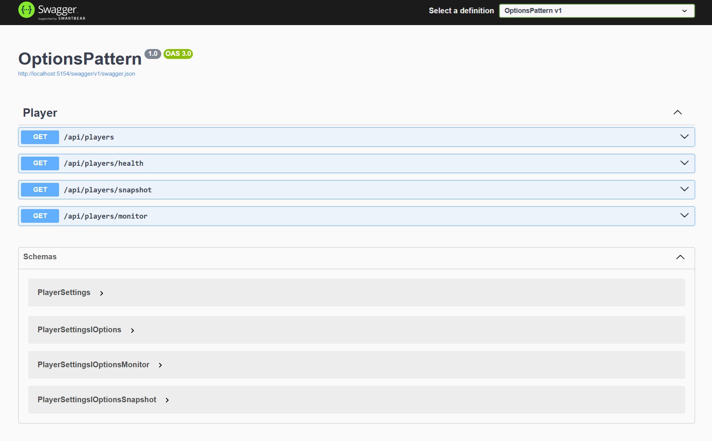

# OPTIONS PATTERN

The PlayerController is an ASP.NET Core API controller that exposes endpoints to retrieve player configuration settings using the **Options Pattern**. It demonstrates the use of **IOptions**, **IOptionsSnapshot**, and **IOptionsMonitor** for accessing configuration data.

## 1. Definitions:
 - IOptions: Provides a snapshot of the configuration at the time it is requested. Singleton services, remain constant throughout the application lifetime.
 - IOptionsSnapshot and IOptionsMonitor: have support for reloading configuration values.
 - IOptionsSnapshot is configured as a scoped service, which means it could be created once per HTTP request.
 - IOptionsMonitor is configured as a singleton service, the current value is always the latest configuration value.

## 2. Functionalities:
- GetPlayerSettings: Returns the current PlayerSettings using IOptions (singleton, lifetime application).
- GetPlayerHealthSettings: Returns only the Health property from PlayerSettings using IOptions.
- GetPlayerSettingsSnapshot: Returns the current PlayerSettings using IOptionsSnapshot (scoped, per-request, supports reload).
- GetPlayerSettingsMonitor: Returns the current PlayerSettings using IOptionsMonitor (singleton, supports live reload).
- Each endpoint is mapped to a specific route defined in ApiEndpoint.Players and returns the configuration data as JSON. This controller is mainly for demonstrating and testing how configuration values can be accessed and refreshed in different ways within an ASP.NET Core application.



## 3. Technologies
- **C#**: Main programming language.
- **.NET 8**: Framework for building the API.
- **Options Pattern**: For managing configuration settings in a structured way.

## 4. How to execute API

To execute this project, follow these steps:

1. **Clone the repository** to your local machine.
2. **Ensure you have .NET 8 SDK** installed.
3. **Restore dependencies** by running:
   ```
   dotnet restore
   ```
5. **Run the API** with:
   ```
   dotnet run
   ```
6. **Access the API documentation** via Swagger at `http://localhost:<port>/swagger` (replace `<port>` with the configured port).